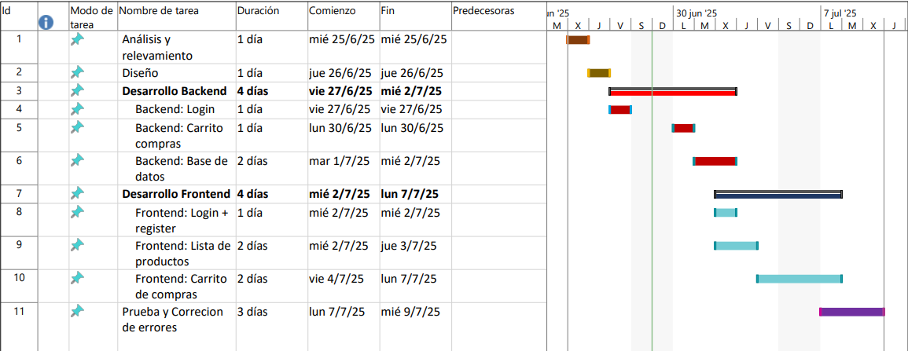
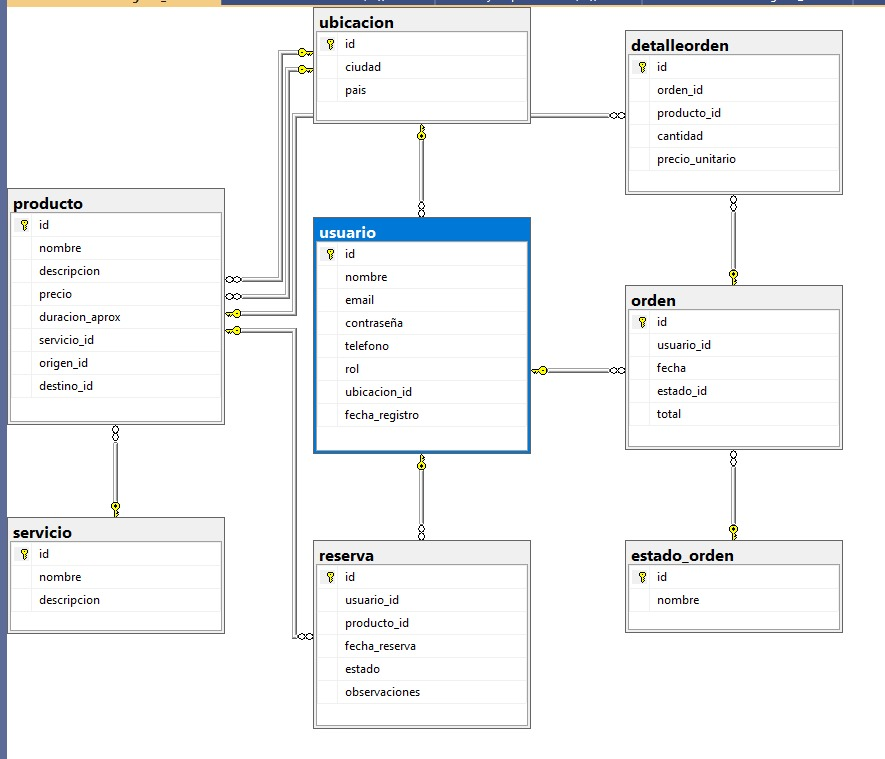

# AeroCastle

---
## Descripción del Proyecto
Este repositorio contiene el proyecto desarrollado para la Olimpíada Nacional de Programación 2025 en la instancia institucional, en el marco de la especialidad Programación.

El objetivo es desarrollar una aplicación web de un carrito de compras para una empresa líder en la comercialización de paquetes turísticos nacionales e internacionales, que permita a los clientes seleccionar productos (paquetes turísticos, pasajes, alquiler de autos, etc.), completar el carrito, realizar pagos y enviar notificaciones vía email tanto al cliente como al sector correspondiente de la empresa.

---
## Equipo de Trabajo
Matias Solis - Rol: Líder de Proyecto

Ignacio Perez - Rol: Analista Funcional

Juan Pablo Castillo - Rol: Diseñador Gráfico

Patricio Nuñez - Rol: Programador 

---

## User Story
Como pasajero interesado en adquirir un paquete turístico,
quiero poder seleccionar diferentes productos turísticos (estadías, pasajes, paquetes completos) desde un portal web,
para poder armar un carrito de compras personalizado, gestionar mis pedidos pendientes, modificar o cancelar compras, y completar el pago de forma segura, recibiendo la confirmación por correo electrónico.

---

##  Criterios de aceptación

-   **Navegación de productos**
    - El cliente puede ver una lista de productos disponibles con código, nombre, descripción y precio unitario.
    - La lista debe estar ordenada y permitir búsquedas o filtros simples (por ejemplo: por nombre o tipo de servicio).

-   **Carrito de compras**
    - El cliente puede agregar múltiples productos al carrito.
    - Se muestra el resumen del carrito: cantidad, subtotal por producto y total general.
    - El cliente puede modificar o eliminar productos antes de confirmar la compra.

-   **Gestión de usuarios**
    - El cliente debe registrarse o iniciar sesión con usuario y contraseña.
    - Se deben validar los datos de acceso.
    - La información de cada cliente debe estar correctamente asociada a sus pedidos.

-   **Gestión de pedidos**
    - Cada compra genera un **número de pedido único**.
    - El cliente puede consultar sus pedidos pendientes, modificarlos o cancelarlos.
    - Una vez que un pedido es entregado, se elimina de los pendientes y pasa al historial de pedidos entregados.

-   **Pago**
    - El total a pagar debe calcularse automáticamente.
    - El pago se gestiona mediante herramientas de terceros (por ejemplo, MercadoPago).
    - El sistema debe registrar el pago correctamente y asociarlo al pedido.

-   **Notificaciones por correo electrónico**
    - Una vez confirmada la compra, se debe enviar un mail automático al cliente con los detalles del pedido.
    - También se envía un correo al área correspondiente de la empresa.

-   **Gestión empresarial (Jefe de ventas)**
    - Puede cargar nuevos productos con código, descripción y precio.
    - Puede consultar el estado de todos los pedidos pendientes y entregados.
    - Puede anular pedidos y ver el estado de cuenta general y por cliente (facturas a cobrar ordenadas por fecha o por cliente).

---

## Tecnologías Utilizadas
Backend: Node.js/TypeScript/Express

Frontend: HTML/CSS/JS

Base de datos: PostgreSQL

---
## Diagrama de Gantt
Cronograma del proyecto

---
## Diagrama de la base de datos
Ejemplo de la base de datos a usar

